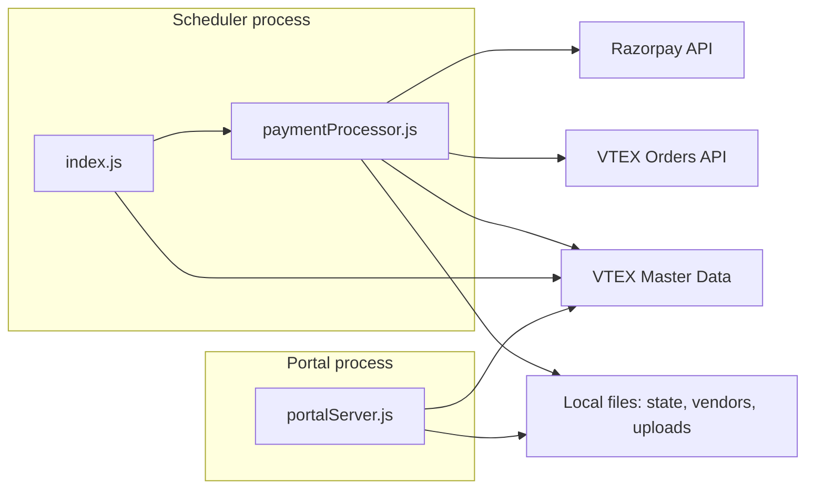

# CoffeeSooq Razorpay Split Payments — Full Documentation

**For management (executive brief):** see [MANAGER_BRIEF.md](./MANAGER_BRIEF.md).

This document has two parts:

- **[Part 1 — Plain language](#part-1-plain-language-for-business-and-operations)** for anyone who needs to understand *what* the system does without reading code.
- **[Part 2 — Technical reference](#part-2-technical-reference)** for developers and DevOps who deploy, configure, and maintain the system.

---

## Part 1: Plain language (for business and operations)

### What is this system?

CoffeeSooq is a marketplace: customers pay once at checkout, but the order can include products from **several sellers**. Razorpay receives the payment on CoffeeSooq’s side. This application:

1. **Finds** eligible payments in Razorpay.
2. **Waits** a fixed number of days (by default **15 days**) before moving money to sellers — so customers can still get refunds during that window.
3. **Figures out** how much each seller should get (using VTEX order data when configured).
4. **Sends** each seller’s share to their **Razorpay linked account** (Route).
5. **Leaves** the remainder on the marketplace’s main Razorpay balance as **commission** (after the math in the code, including GST rules you configured).

You do **not** need to manually split every payment in Razorpay for every seller if VTEX and seller records are set up correctly.

### Simple picture of the money flow

```text
Customer pays → Razorpay (CoffeeSooq) → [hold period] → Transfers to seller linked accounts
                                                      → Rest stays with marketplace (commission)
```

The **hold** is not a separate “locked vault” in this app’s code — it is enforced by **only processing payments whose capture time is old enough** (see technical section). Razorpay’s own settlement and Route behaviour still follow Razorpay’s product rules.

### Who uses the admin portal?

Staff with login access use a web **admin portal** to:

- **Register sellers** (KYC-style fields + bank details) into VTEX Master Data.
- **Adjust environment settings** (stored in `.env` on the server — use with care).
- **Upload a fallback Excel file** if some seller data is not in Master Data.
- **Job runner**: set how often the background job runs (cron) and trigger a **Run now** (still respects business rules like minimum hold days).

### Important ideas in everyday terms

| Term | Simple meaning |
|------|----------------|
| **Captured payment** | Customer’s payment succeeded; money is available for the Route split logic to use (subject to Razorpay and your account setup). |
| **Hold (e.g. 15 days)** | The app **waits** this many days after payment before including it in a transfer batch, so refunds can still happen in that window. The app enforces a **minimum** of 15 days when configured that way. |
| **Linked account** | A Razorpay Route account attached to a **seller** so their share can be transferred to them. |
| **Marketplace commission** | What stays on the main account after seller shares are calculated and transferred. |
| **VTEX order** | The marketplace order in VTEX; the app reads line items to see **which seller** sold **how much**. |

### What can go wrong (non-technical checklist)

- **Wrong VTEX account**: If VTEX URL and API keys belong to different stores, orders will not load — splits will be wrong or missing.
- **Missing order ID on payment**: If Razorpay payment notes do not contain the VTEX order reference, the app may skip or not split correctly.
- **Seller not in Master Data / Excel**: Linked account creation or payouts may fail or be skipped for that seller until data exists.
- **VPN / network / Razorpay errors**: Sometimes APIs return errors from the network; the logs show what happened.
- **DNS / HTTPS**: The public website name (e.g. `payments.coffeesooq.com`) must point to the server before automatic SSL certificates work.

### Security in plain terms

- The admin portal has a **login**. Only trusted people should have credentials.
- **Bank and API secrets** must never be shared in chat or screenshots.
- After first login, **change default passwords** and use **strong secrets** on the server.

---

## Part 2: Technical reference

### Architecture overview



Two separate Node processes are typical in production:

| Process | Entry | Role |
|---------|--------|------|
| Scheduler | `src/index.js` | Cron-driven cycles: fetch payments, resolve sellers, create transfers, update state. |
| Portal | `src/portalServer.js` | Express app: login, seller registration, env editor, XLSX upload, job runner UI. |

### Core business logic (high level)

1. **Time window**: Payments are queried with `from` / `to` derived from `PAYMENT_WINDOW_FROM_DAYS_AGO` and `PAYMENT_WINDOW_TO_DAYS_AGO` (see `src/config.js` and `src/paymentProcessor.js`).
2. **Eligibility**: Only **captured** payments (`status === "captured"` and `captured === true`) are considered; `order_id` may be required depending on path; **hold** uses `HOLD_DAYS` (minimum 15 enforced in config when set).
3. **Idempotency**: `data/state.json` records transferred payment IDs to avoid duplicate transfer attempts.
4. **VTEX path**: Reads `notes.vtexOrderId` (or `vtex_order_id`), fetches order; `vtexClient` may retry with `-01` suffix on 404; `summarizeVtexSellers` aggregates **product subtotals** per seller (line items only, not shipping).
5. **Shipping**: Shipping is **not** included in the seller payout base. Only **product subtotal** is used for commission/seller share. Shipping stays on the **marketplace** account (CoffeeSooq funds shipping).

**Example (amounts in smallest currency unit, e.g. paise):**

| Component | Amount |
|-----------|--------|
| Customer pays (Razorpay) | 1100 |
| Products | 1000 |
| Shipping | 100 |
| Marketplace commission on products (25%) | 250 |
| **Transfer to seller** | **750** (75% of 1000, after GST if any) |
| **Stays on marketplace** | **350** (250 commission + 100 shipping) |

Set **Seller Share %** to `75` when marketplace commission is 25% (or configure per seller in Master Data / Excel).
6. **Seller resolution**: Master Data (`getSellerKycBySellerId`, `upsertSellerKyc`) with fallback XLSX (`vendorExcelRepository.js`).
7. **Linked accounts**: `linkedAccountService.ensureLinkedAccount` — fetch by `accountId` or create with KYC + optional `bank_account` payload.
8. **GST / shares**: `calculateSellerSettlement` uses **product subtotal** and seller share % / GST % from Master Data or Excel vs defaults from env.
9. **Transfers**: `razorpayClient.createTransferFromPayment` with per-seller transfer lines; transfer amount = seller net after GST **minus** shipping deduction.

### Environment variables

Copy from `.env.example` and fill in real values. Common variables:

| Variable | Purpose |
|----------|---------|
| `RAZORPAY_KEY_ID`, `RAZORPAY_KEY_SECRET` | Razorpay API authentication. |
| `VTEX_ENABLED` | Enable VTEX order fetch path. |
| `VTEX_BASE_URL`, `VTEX_APP_KEY`, `VTEX_APP_TOKEN` | Must match the **same** VTEX account (B2B vs B2C hostname alignment). |
| `VTEX_MASTERDATA_ENTITY`, `VTEX_MASTERDATA_SELLER_ID_FIELD` | Master Data entity and seller id field name. |
| `SCHEDULER_CRON` | Cron expression for scheduler (e.g. `*/30 * * * *`). |
| `PAYMENT_WINDOW_FROM_DAYS_AGO`, `PAYMENT_WINDOW_TO_DAYS_AGO` | Razorpay list window relative to “now”. |
| `HOLD_DAYS` | Days after `created_at` before payment is mature (app enforces minimum 15). |
| `GST_PERCENT` | Default GST % when not overridden per seller. |
| `MIN_TRANSFER_AMOUNT`, `CURRENCY` | Transfer validation and currency. |
| `VENDOR_XLSX_FILE` | Path to fallback vendor XLSX on the **machine that runs the scheduler** (use Linux paths on servers). |
| `LOG_RAZORPAY_PAYLOADS` | Verbose Razorpay logging (disable in production if too sensitive). |
| `PORTAL_ENABLED`, `PORTAL_PORT` | Admin portal. |
| `ADMIN_USERNAME`, `ADMIN_PASSWORD` or `ADMIN_PASSWORD_HASH` | Portal login. Prefer hash in production. |
| `SESSION_SECRET`, `SESSION_SECURE_COOKIE` | Express session; set `SESSION_SECURE_COOKIE=true` behind HTTPS. |
| `VTEX_SELLER_FETCH_ONLY`, `SKIP_STARTUP_VENDOR_SYNC` | Operational toggles (see `src/config.js`). |

### Key source files

| File | Responsibility |
|------|----------------|
| `src/index.js` | Scheduler bootstrap, vendor sync hooks, exports `runCycle` for portal “Run now”. |
| `src/paymentProcessor.js` | Payment fetch, maturity, VTEX splits, settlement math, transfers. |
| `src/razorpayClient.js` | Razorpay SDK wrapper + structured logging. |
| `src/vtexClient.js` | VTEX OMS order fetch + order id suffix retry. |
| `src/vtexMasterdataClient.js` | Schema ensure, seller search/upsert, linked account id patch. |
| `src/linkedAccountService.js` | Linked account ensure + bank payload mapping. |
| `src/portalServer.js` | Auth, pages, APIs, job runner, multer uploads. |
| `src/vendorExcelRepository.js` | XLSX fallback parsing. |
| `src/store.js` | JSON state / vendors persistence. |
| `data/state.json` | Idempotency and transfer audit metadata. |
| `data/vendors.json` | Local vendor map (optional sync from Master Data). |
| `ecosystem.config.js` | PM2 definitions for scheduler + portal (production). |

### Admin portal routes (authenticated unless noted)

| Method | Path | Description |
|--------|------|-------------|
| GET | `/login` | Login form. |
| POST | `/login` | Session creation. |
| GET | `/logout` | Destroy session. |
| GET | `/` | Menu. |
| GET/POST | `/seller-registration` | Seller KYC + bank fields → Master Data. |
| GET | `/env-management` | `.env` editor form (posts to API). |
| POST | `/api/admin/env` | Merge updates into `.env`. |
| GET | `/xlsx-upload` | Upload form. |
| POST | `/api/admin/upload-xlsx` | Save XLSX, update `VENDOR_XLSX_FILE`. |
| GET | `/job-runner` | Cron + hold display; Run now. |
| POST | `/job-runner/settings` | Update `HOLD_DAYS`, `SCHEDULER_CRON` in `.env`. |
| POST | `/job-runner/run-now` | Calls `runCycle()`. |

**Note:** Changing `SCHEDULER_CRON` in `.env` requires **restarting the scheduler process** to pick up the new schedule (PM2 restart).

### Local development

```bash
npm install
cp .env.example .env
# edit .env

npm start                 # scheduler + cron
npm run start:once        # single cycle
npm run portal:start      # admin UI
npm run test:fetch-payments
```

### Production deployment (summary)

Typical layout on a small VPS (e.g. DigitalOcean 1 vCPU / 1 GB):

- **Node 20** + **PM2** running `ecosystem.config.js` (scheduler + portal).
- **Nginx** reverse proxy to `127.0.0.1:PORTAL_PORT` (default `3030`).
- **Let’s Encrypt** via `certbot --nginx` after DNS `A` record points to the server.
- **UFW**: allow SSH, HTTP, HTTPS.
- **Swap** recommended on 1 GB RAM.
- `.env` on server: set `SESSION_SECURE_COOKIE=true`, strong `SESSION_SECRET`, prefer `ADMIN_PASSWORD_HASH`, set `VENDOR_XLSX_FILE` to a **Linux absolute path**.
- PM2 boot: use a **systemd unit** that runs `pm2 resurrect` as the deploy user (avoid broken default `Type=forking` + PID file issues on newer systemd).

Repository: [https://github.com/mhadogar/razorpay-splitpayments](https://github.com/mhadogar/razorpay-splitpayments)

### Security checklist

- [ ] Rotate Razorpay keys if exposed; use live keys only on production server.
- [ ] Never commit `.env`; keep `.env` file permissions tight on the server.
- [ ] Replace default `ADMIN_*` and `SESSION_SECRET`.
- [ ] Enable HTTPS and `SESSION_SECURE_COOKIE=true`.
- [ ] Set `LOG_RAZORPAY_PAYLOADS=false` if full payloads are too sensitive for logs.
- [ ] Restrict SSH to keys; disable password auth for SSH when stable.
- [ ] Portal session store is in-memory (`MemoryStore`) — acceptable for single instance; use Redis or similar if you scale horizontally.

### Troubleshooting

| Symptom | Likely cause |
|---------|----------------|
| `406` or failures from Razorpay | Network, IP allowlists, or key environment mismatch — test with `curl` from the same host. |
| VTEX order 404 | Wrong `VTEX_BASE_URL` vs keys; wrong order id format (code retries `-01`). |
| Master Data `Field not found in schema` | Entity schema differs; `ensureSchema` and `_schema` query usage — check logs and VTEX entity configuration. |
| Transfers not created | Payment not captured, not mature, missing `vtexOrderId`, below min amount, or API errors — check scheduler logs. |
| Excel not loading | Wrong `VENDOR_XLSX_FILE` path on Linux server. |
| Portal login loops | Cookie / `SESSION_SECRET` / `SESSION_SECURE_COOKIE` mismatch behind proxy — ensure HTTPS and correct `trust proxy` if you add it later. |

### API dependencies (external)

- **Razorpay**: Payments list, Route accounts, payment transfers (see Razorpay Route documentation for your account type).
- **VTEX**: Orders API (`GET /api/oms/pvt/orders/:orderId`), Master Data API for seller documents and schema.

### Version and support

This documentation describes the application as shipped in this repository. For Razorpay and VTEX behaviour, always confirm against their current official documentation and your account settings.

---

## Document history

- Written for dual audience (operations + engineering) and aligned with the codebase layout and deployment patterns used for CoffeeSooq split payments.
